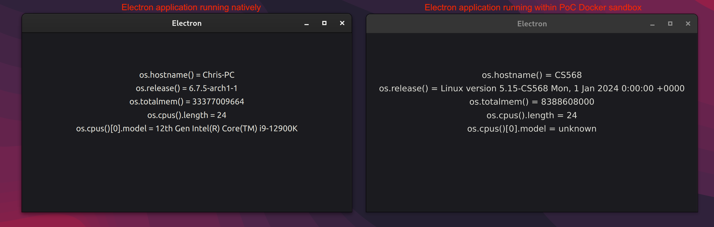

# docker-sandbox
A proposed proof-of-concept sandbox for Electron applications. Provides usability of Electron application while obfuscating machine information and isolating filesystem.



The example Electron application, found in example-electron-app, runs within a Docker container with several methods applied to hide sensitive machine information such as OS model, total memory, and kernel version. This method can be further applied to all machine identifiers, providing anonymity to a user.

The applications attaches to the user's X11 server, displaying the application natively. This PoC is demonstrated working on Linux, and could be easily extended to macOS (and potentially Windows).

## Current Methods:
### Hostname:
Docker already provides a method to change the visable hostname within a Docker container utilizing the `--hostname` flag.

### CPU information:
The interface utilized to get CPU info within Linux is through the `/proc/cpuinfo` file. We utilize a "dummy" cpuinfo file found under `dummy_cpuinfo` and it is volume mounted to the Docker container.

### Memory information:
Similar to CPU information, memory information is obtained through the `/proc/meminfo` file. We utilize a "dummy" meminfo file found under `dummy_meminfo` and it is volume mounted to the Docker container.

### OS version/release information:
While OS information can be found under the `/proc/sys/kernel/` directory, these files cannot be overwritten as they are updated-on-read. Thus, we devloped a simple shared library that intercepts system calls to `uname`. The implementation can be found under `uname.c`. Utilizing the `LD_PRELOAD` environment variable, all calls made to `uname` will need to go through our shared library, allowing us to obfuscate any information provided by `uname`.

## Usage:
These instructions are tested working on an Arch Linux machine utilizing an X11 window server. These instructions may need to be modified to work on a Linux machine utilizing Wayland or macOS.

First, compile the shared library implemented in `uname.c`:
```
gcc -shared -fPIC -o fake_uname.so uname.c -ldl
```

Next, allow your X11 server to allow connections from Docker network (note, this gets cleared on a system restart):
```
xhost +local:docker
```

Build Docker container:
```
sudo docker build -t example-electron-app .
```

Launch Docker container with current anonymity methods. Change volume paths to corresponding file locations:
```
sudo docker run -it --rm \
  --network=host \
  --hostname=CS568 \
  --security-opt seccomp=unconfined \
  --env="DISPLAY" \
  --env="LD_PRELOAD=/app/fake_uname.so" \
  --volume="/tmp/.X11-unix/:/tmp/.X11-unix/:rw" \
  --volume="/var/run/dbus/system_bus_socket:/var/run/dbus/system_bus_socket:ro" \
  --volume="/home/cgrams/example-electron-app/dummy_cpuinfo:/proc/cpuinfo" \
  --volume="/home/cgrams/example-electron-app/dummy_meminfo:/proc/meminfo" \
  example-electron-app

```